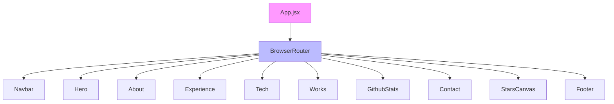

# Personal Portfolio Website

A modern, interactive personal portfolio website built with React, showcasing skills, projects, experience, and contact information. It features smooth animations, 3D elements, and a responsive design optimized for desktop and mobile devices.


## Features

- **Responsive Design**: Fully responsive layout that works on all devices using Tailwind CSS.
- **Interactive Animations**: Powered by Framer Motion for engaging scroll-based animations and transitions.
- **3D Elements**: Integrated Three.js with React Three Fiber for immersive 3D models (e.g., desktop PC and planet models).
- **Project Showcase**: Display of personal projects with images, descriptions, and links.
- **GitHub Integration**: Real-time GitHub stats and contribution calendar.
- **Contact Form**: Functional contact form using EmailJS for sending messages directly.
- **Parallax Effects**: Tilt effects on cards and sections for depth.
- **Stars Canvas**: Animated starry background for a cosmic theme.
- **SEO Optimized**: Includes meta tags and structured for better search engine visibility.

## Tech Stack

### Frontend

- **React**: Core library for building the UI.
- **Vite**: Fast build tool and development server.
- **Tailwind CSS**: Utility-first CSS framework for styling.
- **Framer Motion**: Animation library for smooth interactions.
- **Three.js & React Three Fiber**: For 3D rendering and canvas elements.
- **React Router DOM**: For navigation (though single-page app structure).
- **React Tilt & Parallax Tilt**: For hover tilt effects.
- **AOS (Animate On Scroll)**: Scroll-triggered animations.
- **FontAwesome**: Icons for UI elements.
- **React Vertical Timeline**: For experience timeline.

### Other Tools

- **EmailJS**: Backend-less email sending for contact form.
- **React GitHub Calendar**: GitHub contribution visualization.
- **Maath**: Math utilities for Three.js.

### Build & Deploy

- **ESLint**: Code linting.
- **PostCSS & Autoprefixer**: CSS processing.
- **GH Pages**: Deployment to GitHub Pages.

## Project Structure

```
src/
├── components/          # Reusable UI components
│   ├── About.jsx        # About section
│   ├── Contact.jsx      # Contact form
│   ├── Experience.jsx   # Work experience timeline
│   ├── Feedbacks.jsx    # Testimonials (if used)
│   ├── Footer.jsx       # Footer with links
│   ├── GithubStats.jsx  # GitHub stats display
│   ├── Hero.jsx         # Hero banner
│   ├── Navbar.jsx       # Navigation bar
│   ├── Tech.jsx         # Tech stack showcase
│   ├── Works.jsx        # Projects showcase
│   └── canvas/          # 3D canvas components (StarsCanvas, etc.)
├── constants/           # App constants (e.g., tech stack data)
├── assets/              # Images, icons, and 3D models
│   ├── company/         # Company logos
│   └── tech/            # Tech icons
├── hoc/                 # Higher-Order Components (e.g., SectionWrapper)
├── utils/               # Utility functions (e.g., motion variants)
├── App.jsx              # Main app component
├── main.jsx             # Entry point
└── index.css            # Global styles
```

## Flow Diagram

### Component Hierarchy (Mermaid Diagram)



This diagram illustrates the top-level component flow: The app wraps everything in a router, rendering sections sequentially with the hero pattern background.

### User Flow

```mermaid
flowchart LR
    Start([Visitor Lands on Site]) --> Navbar[Navigation Menu]
    Navbar --> Hero[Hero Section - Intro & CTA]
    Hero --> Scroll[Scroll Down]
    Scroll --> About[About Me]
    About --> Experience[Experience Timeline]
    Experience --> Tech[Tech Stack]
    Tech --> Works[Featured Projects]
    Works --> GithubStats[GitHub Activity]
    GithubStats --> Contact[Contact Form]
    Contact --> Submit[Submit Message via EmailJS]
    Submit --> Footer[Footer - Social Links]
    Footer --> End([Explore Links or Reload])
```



This flow shows the typical user journey through the portfolio sections.

## Screenshots

### Hero Section


### About Section

 <!-- Replace with actual if available; otherwise, describe -->

### Tech Stack

 <!-- Assets include tech icons like reactjs-C2MbG7jx.png -->

### Projects

 <!-- e.g., carrent-XLSc4ln5.png, jobit-ZLvUsGJU.png -->

### 3D Desktop PC Model

The site includes interactive 3D models loaded from GLTF files in `public/desktop_pc/` and `public/planet/`.

### Mobile View


For more visuals, check the [live demo](https://kamlesh-bhatt-52625.github.io/) (from package.json homepage).

## Installation

1. **Clone the Repository**

   ```bash
   git clone https://github.com/yourusername/portfolio.git  # Replace with your repo URL
   cd portfolio
   ```

2. **Install Dependencies**

   ```bash
   npm install
   ```

3. **Environment Setup**
   - For EmailJS: Get your service ID, template ID, and public key from [EmailJS](https://www.emailjs.com/) and add them to `src/components/Contact.jsx`.
   - Update GitHub username in `src/components/GithubStats.jsx` for stats.
   - Customize content in `src/constants/index.js` (e.g., projects, experience data).

## Usage

### Development

Run the development server:

```bash
npm run dev
```

Open [http://localhost:5173](http://localhost:5173) to view it in the browser. The page will reload on changes.

### Build for Production

```bash
npm run build
```

This creates an optimized build in the `build/` directory.

### Preview Build

```bash
npm run preview
```

### Linting

```bash
npm run lint
```

## Deployment

The project is set up for deployment to GitHub Pages:

1. Install GH Pages (if not already):

   ```bash
   npm install --save-dev gh-pages
   ```

2. Add to `package.json` (already present):

   ```json
   "homepage": "https://yourusername.github.io/repo-name"
   ```

3. Deploy:
   ```bash
   npm run deploy
   ```

This builds the project and pushes the `build/` folder to the `gh-pages` branch.

For other hosts (Netlify, Vercel), simply connect your repo and deploy the build folder.

## Customization

- **Update Content**: Edit `src/constants/index.js` for projects, testimonials, experience.
- **Add Projects**: Add to `works` array in constants and update `src/components/Works.jsx`.
- **Change Theme**: Modify Tailwind config in `tailwind.config.js`.
- **3D Models**: Replace GLTF files in `public/desktop_pc/` or `public/planet/` with your own models.

## Contributing

Contributions are welcome! Please fork the repo and submit a pull request.

1. Fork the project.
2. Create a feature branch (`git checkout -b feature/AmazingFeature`).
3. Commit changes (`git commit -m 'Add some AmazingFeature'`).
4. Push to the branch (`git push origin feature/AmazingFeature`).
5. Open a Pull Request.

## License

This project is open-source and available under the MIT License. See the [LICENSE](LICENSE) file for details (create one if needed).

⭐ If you found this useful, give it a star on GitHub!
